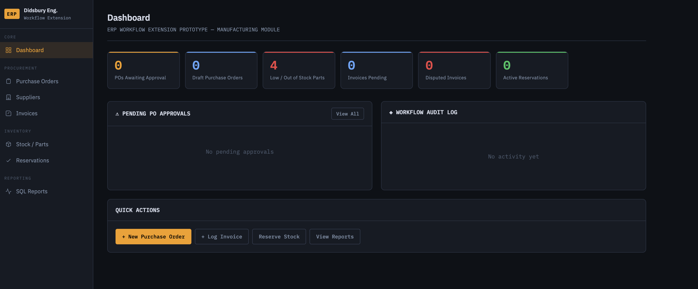
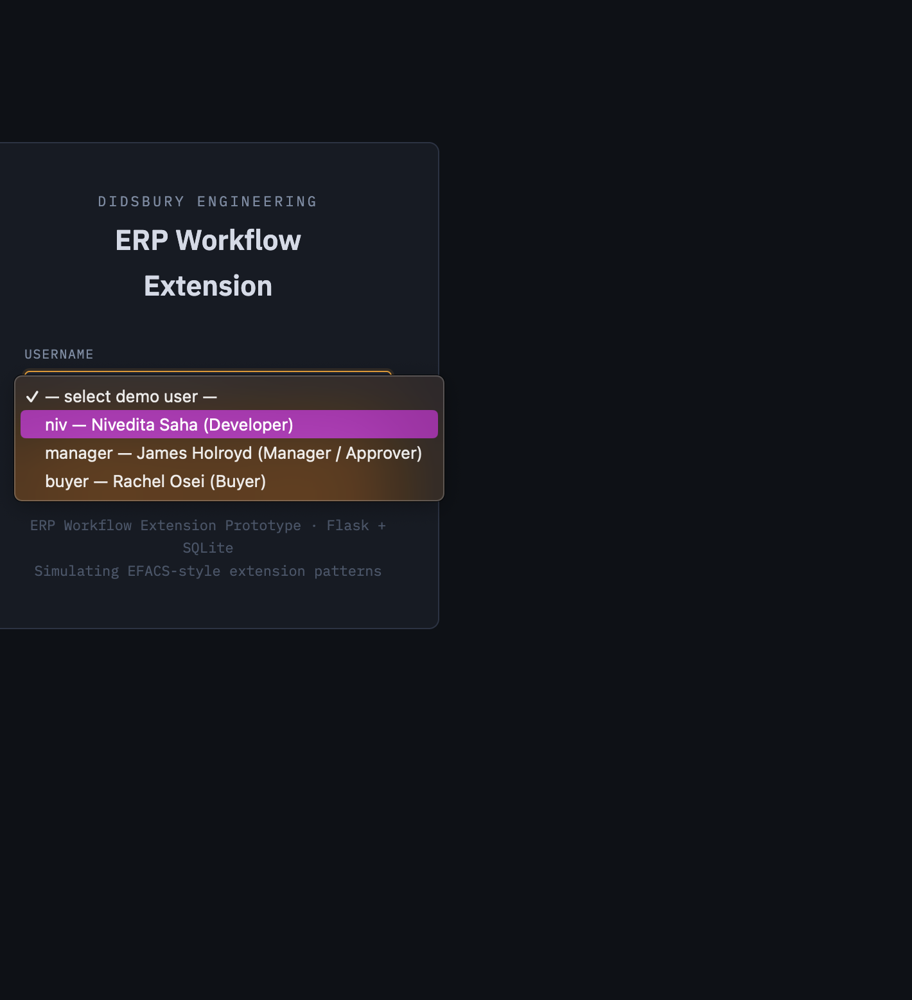
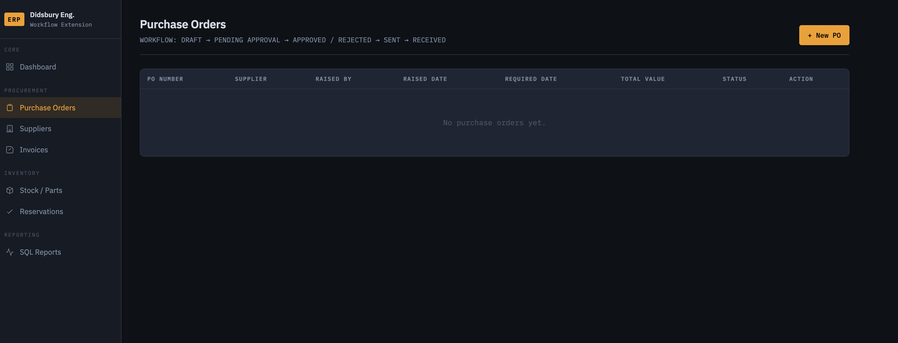
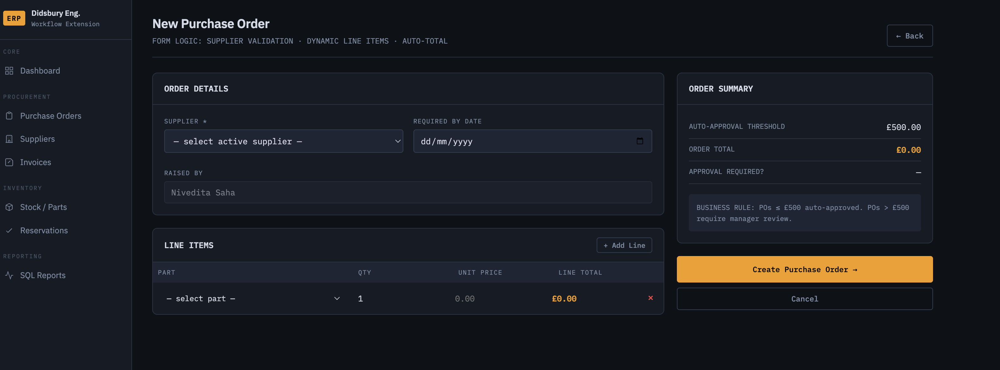
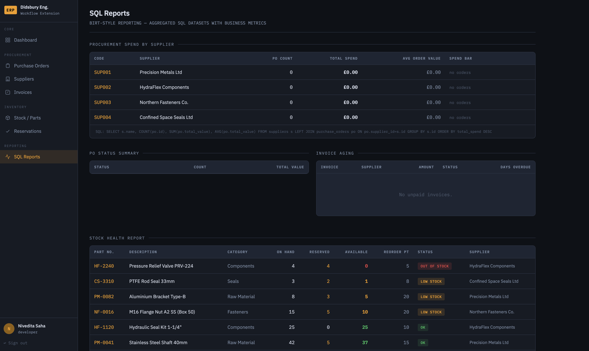
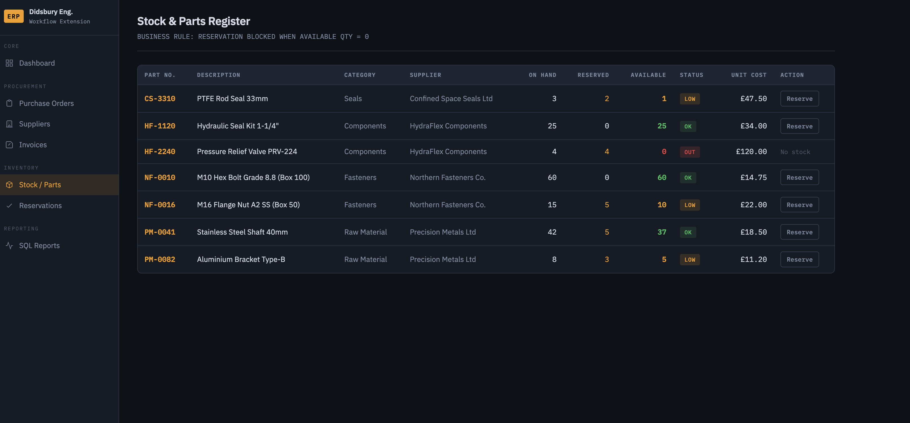
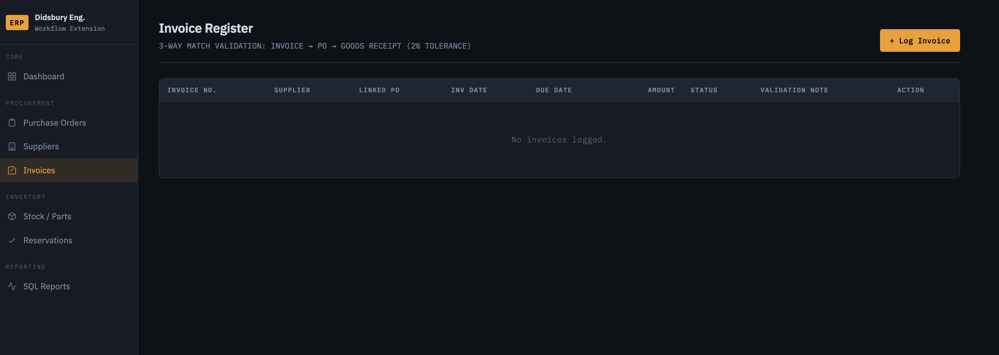
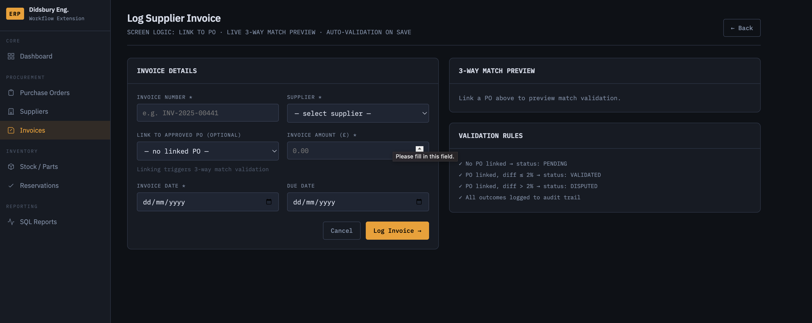
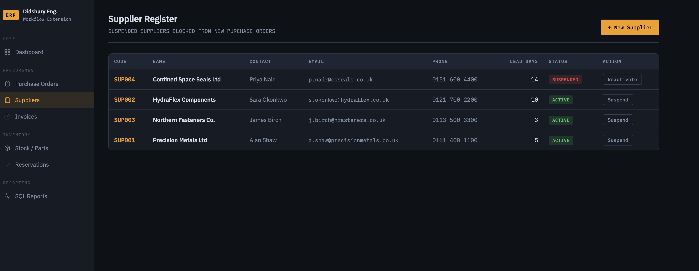
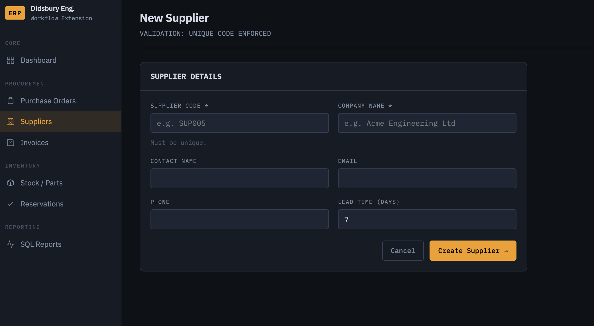

# ERP Workflow Extension Prototype

> **A lightweight, form-driven ERP module** simulating the screen logic, business rule validation, and workflow triggers found in systems like EFACS (Exel). Built as a portfolio demonstration of ERP extension development patterns for a precision engineering / manufacturing context.



---

## Screenshots

| | |
|---|---|
|  |  |
| **Dashboard — KPI stats & audit log** | **Purchase Order list with status workflow** |
|  |  |
| **New PO — dynamic line items & live approval flag** | **SQL Reports — BIRT-style aggregated datasets** |
|  |  |
| **Stock & Parts Register — live availability check** | **Stock Reservations — active holds against qty** |
|  |  |
| **Invoice Register — 3-way match validation** | **Log Invoice — live match preview before save** |
|  |  |
| **Supplier Register — status lifecycle management** | **New Supplier — validated form with unique code** |

---

## Overview

This prototype replicates the kind of work done when extending a vendor ERP system — building custom screens, enforcing business rules without touching core vendor code, creating SQL-driven reports, and implementing multi-step approval workflows. It targets the exact patterns used in **EFACS by Exel** for precision engineering environments.

**Stack:** Python · Flask · SQLite · Jinja2 · Vanilla JS

---

## Modules Implemented

### 1. Purchase Order Approval Workflow
- Create POs with dynamic line items and live order totals
- **Business Rule:** POs ≤ £500 are auto-approved on submission; POs above threshold route to manager review
- Role-based approval: only users with `can_approve` permission can approve/reject
- Full rejection reason capture and audit trail
- PO status lifecycle: `DRAFT → PENDING_APPROVAL → APPROVED/REJECTED → SENT → RECEIVED`

### 2. Stock Reservation with Availability Check
- Parts register with live available qty = `qty_on_hand − qty_reserved`
- **Business Rule:** Reservation blocked server-side if requested quantity exceeds available stock
- Reservations reduce available stock immediately; cancellation releases it
- Visual stock status: `OK / LOW STOCK / OUT OF STOCK` based on reorder points

### 3. Supplier Management
- Supplier register with status lifecycle (`ACTIVE / SUSPENDED / PENDING`)
- **Business Rule:** Suspended suppliers excluded from PO creation dropdowns
- Lead time captured per supplier and surfaced in PO form as a screen hint

### 4. Invoice Validation (3-Way Match)
- Invoices linked to approved POs
- **Business Rule:** Automatic 3-way match on save — if invoice amount differs from PO value by more than 2%, invoice is flagged `DISPUTED`; within tolerance → `VALIDATED`
- Live match preview in form before submission
- Approval workflow for validated invoices

### 5. SQL Reporting (BIRT-Style)
- Procurement spend by supplier (`COUNT`, `SUM`, `AVG` aggregations)
- Purchase order status summary
- Invoice aging report (using `julianday()` to simulate SQL Server `DATEDIFF`)
- Stock health report with `CASE` expression for status classification
- SQL shown inline below each table — mirrors BIRT dataset transparency

### 6. Workflow Audit Log
- Every state change written to `workflow_log` — immutable record of entity, action, user, timestamp, and note
- Displayed on dashboard and individual PO detail views

---

## ERP Extension Patterns Demonstrated

| Pattern | Where Demonstrated |
|---|---|
| Custom screen with form logic | PO form — dynamic line items, live total, approval flag |
| Business rule enforcement | PO threshold, stock availability check, 3-way match |
| Workflow state machine | PO lifecycle: DRAFT → APPROVED / REJECTED |
| Role-based action gating | Approval buttons shown/hidden by user role and status |
| Audit trail / event log | `workflow_log` table on dashboard and PO detail views |
| SQL aggregation reporting | Reports page — spend, status summary, aging, stock health |
| Vendor extension without core modification | All logic in application layer; schema is purely additive |
| Lead time / supplier data surfaced in UI | Supplier lead days shown as hint in PO form |

---

## Database Schema

```
suppliers       → code, name, contact, status, lead_days
parts           → part_number, qty_on_hand, qty_reserved, reorder_point
purchase_orders → po_number, supplier_id, status, total_value, approval fields
po_lines        → po_id, part_id, qty_ordered, unit_price, line_total (generated column)
reservations    → part_id, qty_reserved, reserved_for, status
invoices        → invoice_number, po_id, amount, status, validation_note
workflow_log    → entity_type, entity_id, action, performed_by, note, logged_at
```

---

## Getting Started

```bash
git clone https://github.com/Nivedita-Saha/erp-workflow-prototype.git
cd erp-workflow-prototype
pip install flask
mkdir -p instance
python app.py
```

Open `http://localhost:5050` and select a demo user:

| Username | Role | Can Approve? |
|---|---|---|
| `niv` | Developer | Yes |
| `manager` | Manager | Yes |
| `buyer` | Buyer | No |

---

## Project Structure

```
erp-workflow-prototype/
├── app.py                  # Flask app — routes, business logic, workflow rules
├── schema.sql              # DB schema + seed data (4 suppliers, 7 precision parts)
├── requirements.txt
├── templates/              # Jinja2 templates — one per ERP screen
│   ├── base.html           # Sidebar navigation layout
│   ├── dashboard.html      # KPI stats + audit log
│   ├── po_form.html        # PO creation with dynamic line item builder
│   ├── po_detail.html      # PO view + approval panel
│   ├── reports.html        # SQL reports dashboard
│   └── ...
└── static/
    ├── css/style.css       # Industrial-utilitarian design (IBM Plex, dark theme)
    └── js/main.js
```

---

## Relevance to EFACS / ERP Development

| JD Requirement | Demonstrated By |
|---|---|
| Custom EFACS screens, buttons, form logic | PO form with live JS logic, conditional approval panel |
| Business rule enforcement | Auto-approval threshold, stock check, 3-way match |
| Extend without modifying core vendor code | All logic in app layer; schema is additive only |
| SQL Server queries — joins, aggregation, CTEs | Reports page with multi-table joins, CASE, date arithmetic |
| BIRT-style reporting with SQL datasets | Reports page shows underlying SQL beneath each dataset |
| Workflow triggers and audit trail | `workflow_log` fires on every state transition |
| Role-based access control | Approval actions gated by user role |

---

*Built by Nivedita Saha · MSc Artificial Intelligence & Data Science (Distinction) · Keele University 2025*
